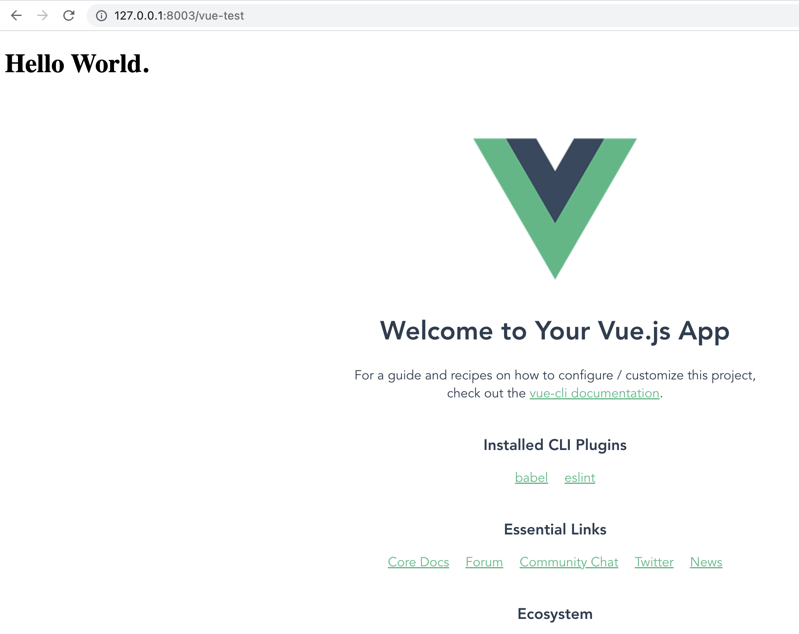

## Installing / Getting started
```bash
pip install django-user-accounts psycopg2-binary jsonfield django==3.2.7
```
A quick introduction of the minimal setup you need to get the app up & running on a local computer. 

```bash
# Usage Guide
# Step 1: Download repo
cd code
python manage.py runserver (port) # or you can specify the ip:port_no
# you can see the below picture at:
http://localhost:8000/vue-test # or your designated port
```


- *Note*: before commit, please run `find . -name "*.pyc" -exec rm -f {} \;` to remove the pyc files.

```bash
# rm -rf db.sqlite3, if some key is not found, you can del db.sqlite3, otherwise no need
python manage.py makemigrations
python manage.py migrate
```

Next, `touch sever.sh` and `vi server.sh` with following commands:
```bash
myip=
while IFS=$': \t' read -a line ;do
    [ -z "${line%inet}" ] && ip=${line[${#line[1]}>4?1:2]} &&
        [ "${ip#127.0.0.1}" ] && myip=$ip
  done< <(LANG=C /sbin/ifconfig)
echo $myip
python manage.py runserver $myip:8000
```
or use the default ip:
```bash
python manage.py runserver
```

- If you use vscode, follow the launch.json
  ```bash
  {
      "version": "0.2.0",
      "configurations": [
          {
              "name": "Python: Current File",
              "type": "python",
              "request": "launch",
              "program": "${file}",
              "console": "integratedTerminal"
          },
          {
              "name": "Python: Django",
              "type": "python",
              "request": "launch",
              "program": "code/manage.py",
              "args": [
                  "runserver"
              ],
              "django": true
          },
          {
              "name": "Python: Django test_del_project",
              "type": "python",
              "request": "launch",
              "program": "manage.py",
              "args": [
                  "test",
                  "myapp.tests.test_del_project"
              ],
              "django": true
          }
      ]
  }
  ```

### Test Case & Logging
- Test case for create_project
  ```python
  # code/backend/code/myproject/urls.py
  path('create_project_api', myapp_create_project.create_project),
  ## Step 1: Create test users
  ## Step 2: Create project through http://127.0.0.1:8000/create_project_api
  ```
  - All test cases are passed.
- Test case for return_all_project_api
  ```python
  # code/backend/code/myproject/urls.py
  path('return_all_project_api', myapp_return_all_project.return_all_project),
  ## Step 1: Create test users
  ## Step 2: Create project through http://127.0.0.1:8000/create_project_api
  ## Step 3: Return all projects without inputs http://127.0.0.1:8000/return_all_project_api
  ## Step 4: Return all projects with inputs http://127.0.0.1:8000/return_all_project_api
  ```
- Test case for project_page_api
  ```python
  # code/backend/code/myproject/urls.py
  path('project_page_api', myapp_project_page.project_page),
  ## Step 1: Create test users
  ## Step 2: Create project through http://127.0.0.1:8000/create_project_api
  ## Step 3: Return all projects without inputs http://127.0.0.1:8000/return_all_project_api
  ## Step 4: Return all projects with inputs http://127.0.0.1:8000/return_all_project_api
  ## Step 5: Return project page with id http://127.0.0.1:8000/project_page_api
  ```
- Test case for apply_to_project_api
  ```python
  # code/backend/code/myproject/urls.py
  path('apply_to_project_api', myapp_apply_to_project_page.apply_to_project),
  ## Step 1: Create test users
  ## Step 2: Create project through http://127.0.0.1:8000/create_project_api
  ## Step 3: Return all projects without inputs http://127.0.0.1:8000/return_all_project_api
  ## Step 4: Apply to project with inputs 1 http://127.0.0.1:8000/apply_to_project_api
  ## Step 5: Apply to project with inputs 2 http://127.0.0.1:8000/apply_to_project_api
  ## Step 6: Return projects http://127.0.0.1:8000/return_all_project_api
  ```
- Test case for return_student_without_proj_num
  ```python
  # code/backend/code/myproject/urls.py
  path('return_student_without_proj_num_api', myapp_return_student_num.return_student_without_proj_num),
  ## Step 1: Create test users
  ## Step 2: Create project through http://127.0.0.1:8000/create_project_api
  ## Step 3: Return all projects without inputs http://127.0.0.1:8000/return_all_project_api
  ## Step 4: Edit project add student in project http://127.0.0.1:8000/project_page_edit_api
  ## Step 5: http://127.0.0.1:8000/return_student_without_proj_num_api
  ```

  - Test case for return_student_with_proj_num
  ```python
  # code/backend/code/myproject/urls.py
  path('return_student_without_proj_num_api', myapp_return_student_num.return_student_with_proj_num),
  ## Step 1: Create test users
  ## Step 2: Create project through http://127.0.0.1:8000/create_project_api
  ## Step 3: Return all projects without inputs http://127.0.0.1:8000/return_all_project_api
  ## Step 4: Edit project add student in projec http://127.0.0.1:8000/project_page_edit_api
  ## Step 5: 'http://127.0.0.1:8000/return_student_with_proj_num_api'
  ```

  - Test case for del_project
  ```python
  path('del_project_api', myapp_del_project.del_project)
  ## Step 1: Create test users
  ## Step 2: Create project through http://127.0.0.1:8000/create_project_api
  ## Step 3: Return all projects without inputs http://127.0.0.1:8000/return_all_project_api
  ## Step 4: 'http://127.0.0.1:8000/del_project_api'
  ```
  
  To create new instance of instructor account before running server.
  ```bash
  echo "import os;from myapp.models import instructor;import binascii; ins = instructor.objects.get_or_create(name='Instructor', avatar='tiger', type=1, password='123456', defaults={'email':'admin@jhu.edu'}, uid=binascii.hexlify(os.urandom(20)).decode())" | python manage.py shell
  ```
